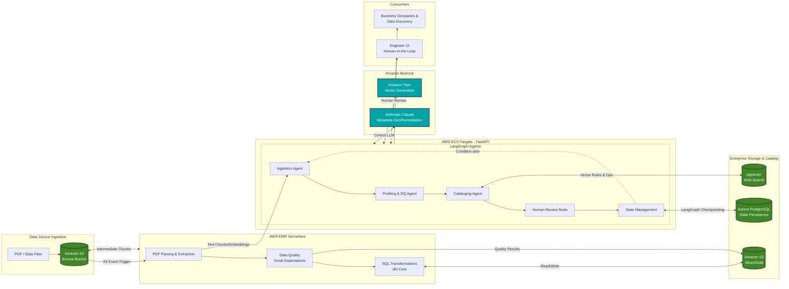

# Enterprise AI-Driven Data Quality & Cataloging Agent

**Version:** 1.0.0  
**Architecture:** Medallion (Bronze → Silver → Gold) + LangGraph State Machine  
**Stack:** PySpark, Great Expectations, LangGraph, Aurora PostgreSQL + pgvector, Amazon Bedrock  
**Deployment:** Terraform (3-tier segregated state) + ECS Fargate + EMR Serverless

---

## System Architecture

### Core Stack Decisions

| Layer | Technology | Rationale |
|-------|-----------|-----------|
| **Storage** | S3 (Bronze/Silver/Gold) | Immutable object store with Hive-style partitioning; cost-effective for data lake patterns |
| **Batch Processing** | PySpark on EMR Serverless | Distributed compute for large-volume Bronze → Silver validation; serverless to avoid idle cluster cost |
| **Data Quality** | Great Expectations | Declarative expectation suites; native PySpark integration; in-memory ephemeral context avoids deployment overhead |
| **Orchestration** | LangGraph on ECS Fargate | Stateful graph with Postgres checkpointing; conditional routing for quality gates; retry loops |
| **Vector Store** | Aurora PostgreSQL + pgvector | Single managed service for both LangGraph state persistence and vector ANN search; no external vector DB to operate |
| **LLM Integration** | Amazon Bedrock (Claude 3.5 Sonnet + Titan Embeddings) | No GPU infrastructure to manage; native AWS IAM integration; lowest-latency option within VPC |
| **State Segregation** | Terraform (3 states) | Isolate blast radius: networking changes don't affect DB, DB changes don't affect task definitions |
| **Schema Migrations** | Alembic | Decouple schema evolution from Terraform; application-owned schema changes without infrastructure review |
| **Observability** | OpenTelemetry → CloudWatch | Vendor-neutral instrumentation; structured JSON logging for metric extraction via CloudWatch Logs Insights |

---
