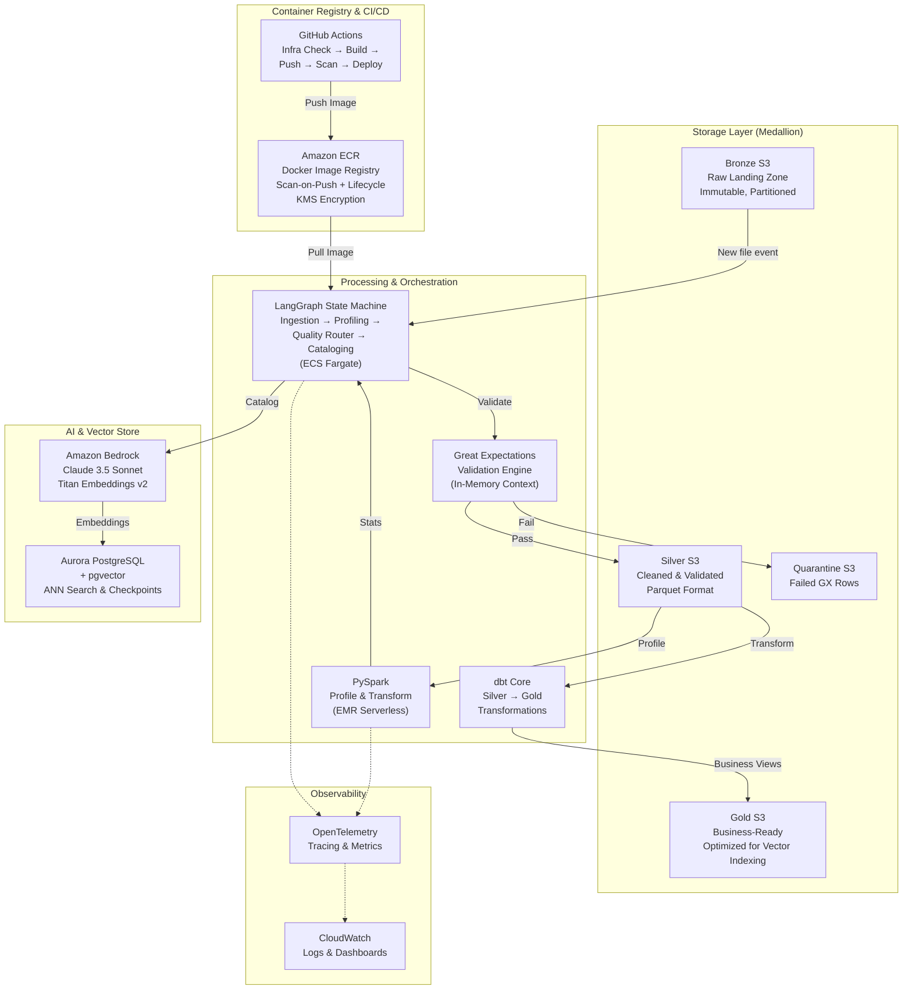
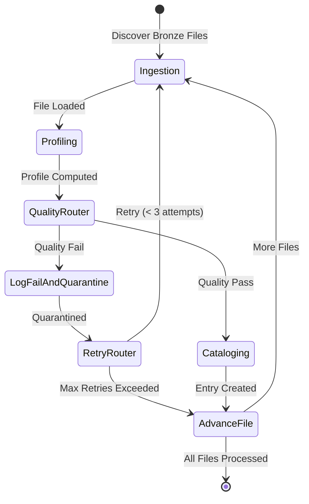

# Enterprise AI-Driven Data Quality & Cataloging Agent

**Version:** 1.0.0  
**Architecture:** Medallion (Bronze → Silver → Gold) + LangGraph State Machine  
**Stack:** PySpark, Great Expectations, LangGraph, Aurora PostgreSQL + pgvector, Amazon Bedrock  
**Deployment:** Terraform (3-tier segregated state, SSM-linked) + ECS Fargate + EMR Serverless  
**Container Registry:** Amazon ECR (auto-provisioned via Terraform, scan-on-push, lifecycle-managed)  
**Dependency Management:** [uv](https://docs.astral.sh/uv/) by Astral

---

## System Overview

This agent autonomously ingests raw data from S3 Bronze zones, validates it with Great Expectations (strict barrier before Silver), computes statistical profiles via PySpark, generates rich metadata descriptions via Bedrock Claude 3.5 Sonnet, embeds them via Titan Embeddings, and persists searchable catalog entries to a pgvector-powered semantic store.

**Data flow:** `Bronze S3 → GX Validation (pass/fail barrier) → Silver S3 → PySpark Profiling → LLM Cataloging → pgvector Store`

---

## Key Features

| Feature | Description |
|---------|-------------|
| **Automated Data Ingestion** | Discovers new files in S3 Bronze zones, processes them through the LangGraph state machine |
| **Great Expectations Validation** | Applies configurable expectation suites; routes failures to a quarantine S3 path with structured metadata |
| **PySpark Profiling** | Computes statistical profiles (row count, null ratios, distinct values, min/max, schema inference) |
| **LLM-Powered Cataloging** | Generates rich, human-readable metadata descriptions via Amazon Bedrock Claude 3.5 Sonnet |
| **Semantic Search** | Embeddings via Titan Embeddings v2, stored in pgvector for ANN similarity search |
| **Stateful Orchestration** | LangGraph with PostgresSaver checkpointer for durable, resumable agent execution |
| **Observability** | OpenTelemetry tracing routed to CloudWatch; structured logging throughout |
| **Infrastructure as Code** | 3-tier segregated Terraform state (core-static → platform-medium → app-dynamic) with SSM handoff |
| **Container Registry** | Amazon ECR with automated vulnerability scanning, lifecycle policies (14-day untagged expiry), KMS encryption, and least-privilege IAM |
| **CI/CD Infrastructure Gate** | Pre-build validation ensures all AWS resources exist before the pipeline spends time building and pushing Docker images |

---

## Architecture

### System Topology



### LangGraph State Machine Flow



---

## Core Stack Decisions

| Decision | Rationale |
|----------|-----------|
| **Ephemeral GX Context** | No GX deployment directory needed; history persisted to `catalog.quality_runs` |
| **3-tier Terraform state** | Blast radius isolation: networking ≠ DB ≠ application code |
| **SSM parameter handoff** | Stable API contract between tiers (no `terraform_remote_state` coupling) |
| **pgvector over dedicated DB** | Same Aurora cluster for LangGraph checkpoints + vector ANN search |
| **tenacity retry wrappers** | Exponential backoff + jitter on Bedrock and S3 calls |
| **uv (Astral) over Poetry** | 10-100× faster dependency resolution, PEP 621 native, simpler lockfile management |
| **Multi-stage Docker build** | Minimal production image (~200MB vs ~1GB with full build toolchain) |
| **Alembic for migrations** | Version-controlled, reversible schema changes; autogenerate from SQLAlchemy models |
| **ECR scan-on-push + lifecycle** | Every image is vulnerability-scanned at push; untagged images auto-expire after 14 days to control costs |
| **CI/CD infra validation gate** | Pre-build check prevents wasting build minutes on missing infrastructure; fails fast with actionable error messages |

---

## Repository Layout

```
├── .github/workflows/          # CI/CD: 3 infra tiers + 1 app pipeline (with infra check gate)
├── infrastructure/
│   ├── modules/                # Terraform: networking, storage, DB, compute, observability, repository
│   ├── 01-core-static/dev/     # LIFECYCLE TIER 1: VPC, S3, KMS (SSM→tier 2)
│   ├── 02-platform-medium/dev/ # LIFECYCLE TIER 2: Aurora, ECS, EMR, ECR, IAM (SSM→tier 3)
│   └── 03-application-dynamic/ # LIFECYCLE TIER 3: Task defs, events, alarms
├── src/
│   ├── agents/                 # LangGraph state machine (ingestion→profiling→cataloging)
│   ├── data_pipeline/quality/  # Great Expectations validation engine
│   ├── data_pipeline/transformations/  # dbt Silver→Gold models
│   ├── db_migrations/          # Alembic schema migrations
│   └── common/                 # Config (pydantic) + OpenTelemetry
├── local_development/          # Docker Compose + init scripts
├── tests/                      # Unit + integration tests
├── Dockerfile                  # Multi-stage Docker build (uv-based)
├── Makefile                    # Dev workflow targets (uv-based)
├── pyproject.toml              # PEP 621 manifest (uv-managed)
├── uv.lock                     # Deterministic dependency lockfile
└── .env.example                # Env template → .env
```

## Quick Start

```bash
# Prerequisites: Docker Desktop 4.25+, Python 3.12+, uv 0.5+

# macOS/Linux:
cp .env.example .env
make local-up          # Start Postgres+pgvector+LocalStack
uv sync                # Install dependencies (including dev)
uv run alembic upgrade head   # Run database migrations
uv run python -m src.agents.graph_builder  # Run the agent
make test              # Run tests
```

```powershell
# Windows (PowerShell):
Copy-Item .env.example .env
cd local_development; docker compose up -d; cd ..
uv sync
uv run alembic upgrade head
uv run python -m src.agents.graph_builder
uv run pytest -v
```

## Documentation

- [Development Guide](DevGuide.md) — Adding nodes, expectation suites, local dev workflows, code release process, Terraform module creation
- [Operations Runbook](Runbook.md) — Day 1 deployment, Day 2 recovery, Alembic migrations, ECR lifecycle management, on-call procedures

## License

MIT
